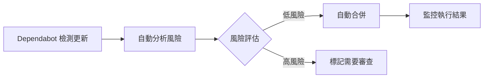

# 🔧 GitHub Actions 系統後續維護指南

## 📋 維護概述

本文檔提供 GitHub Actions 優化系統的長期維護策略，確保系統持續穩定運行並保持最佳效能。

## 📅 定期維護計劃

### 🗓️ 每週維護 (週一執行)

#### 自動化檢查
- **Dependabot PR 審查**: 檢查本週產生的 Dependabot PR
- **自動合併監控**: 驗證自動合併功能正常運作

```bash
# 檢查本週 Dependabot PR
gh pr list --label "dependencies" --state "all" --limit 10

# 查看自動合併成功率
gh pr list --label "auto-merge-candidate" --state "merged" --limit 5
```

#### 手動檢查項目
- [ ] 檢查 CI/CD 狀態儀表板
- [ ] 審查任何失敗的自動化流程
- [ ] 確認版本管理腳本正常運作

### 🗓️ 每月維護 (每月第一個週五)

#### 深度安全掃描
```bash
# 執行完整安全檢查
./scripts/actions-version-manager.sh --security-scan --report

# 檢查所有 Actions 更新
./scripts/actions-version-manager.sh --check-updates

# 生成月度報告
./scripts/actions-version-manager.sh --report
```

#### 檢查項目
- [ ] 審查所有 GitHub Actions 版本
- [ ] 檢查是否有新的安全漏洞公告
- [ ] 更新文檔中的版本資訊
- [ ] 評估自動化規則的有效性

### 🗓️ 季度維護 (每季第一週)

#### 系統優化評估
- [ ] 分析自動化效能指標
- [ ] 評估工具使用效率
- [ ] 檢討並更新最佳實踐
- [ ] 規劃系統改進項目

#### 完整系統檢查
```bash
# 完整系統掃描
./scripts/actions-version-manager.sh --scan --security-scan --check-updates --report

# 備份當前配置
./scripts/actions-version-manager.sh --backup

# 檢查 Dependabot 配置
cat .github/dependabot.yml | yq eval '.updates[] | select(.package-ecosystem == "github-actions")'
```

## 🚨 監控與告警

### 關鍵指標監控

#### 1. 自動化成功率
```bash
# 查看 Dependabot PR 處理統計
gh api graphql -f query='
{
  repository(owner: "p8552015", name: "lineMCP") {
    pullRequests(first: 50, states: MERGED, labels: ["dependencies"]) {
      nodes {
        title
        labels(first: 10) {
          nodes {
            name
          }
        }
        mergedAt
      }
    }
  }
}'
```

#### 2. CI/CD 健康度
- **目標**: 95% 以上成功率
- **監控**: GitHub Actions 執行狀態
- **告警**: 連續失敗 3 次以上

#### 3. 安全風險指標
- **目標**: 0 個不安全版本標籤
- **監控**: 定期安全掃描
- **告警**: 發現新的安全風險

### 告警機制設定

#### GitHub Actions 失敗告警
```yaml
# 建議新增到主要 workflows
- name: 📧 失敗通知 (可選)
  if: failure()
  uses: actions/github-script@v7
  with:
    script: |
      github.rest.issues.createComment({
        owner: context.repo.owner,
        repo: context.repo.repo,
        issue_number: context.issue.number,
        body: '🚨 CI/CD 流程失敗，請立即檢查!'
      });
```

## 🔄 版本更新策略

### GitHub Actions 更新原則

#### 1. 官方 Actions (actions/*)
- **策略**: 使用主版本標籤 (`@v4`, `@v5`)
- **更新頻率**: 自動更新 (透過 Dependabot)
- **風險評估**: 低風險，可自動合併

#### 2. 第三方 Actions
- **策略**: 使用具體版本號 (`@v1.2.3`)
- **更新頻率**: 每月評估
- **風險評估**: 中等風險，需要人工審查

#### 3. 安全掃描工具
- **策略**: 及時更新到最新版本
- **更新頻率**: 發布後 1 週內
- **風險評估**: 安全優先，快速更新

### 更新執行流程

#### 自動更新 (低風險)


#### 手動更新 (高風險)
1. **評估階段**: 查看 changelog 和破壞性變更
2. **測試階段**: 在開發分支測試新版本
3. **審查階段**: 代碼審查和安全檢查
4. **部署階段**: 逐步推廣到生產環境

## 🛠️ 故障處理程序

### 緊急故障響應

#### Level 1: CI 完全失敗
**症狀**: 所有 workflows 無法執行
**響應時間**: 1 小時內

```bash
# 緊急診斷步驟
echo "1. 檢查 GitHub 服務狀態"
curl -s https://www.githubstatus.com/api/v2/summary.json | jq '.status.description'

echo "2. 檢查最近的變更"
git log --oneline -10

echo "3. 快速回滾到上一個工作版本"
git revert HEAD --no-edit
git push origin main

echo "4. 檢查特定 workflow"
gh run list --workflow=ci-enhanced.yml --limit=5
```

#### Level 2: 部分功能異常
**症狀**: 特定 workflow 或 Action 失敗
**響應時間**: 4 小時內

```bash
# 詳細診斷步驟
echo "1. 檢查特定 Action 狀態"
./scripts/actions-version-manager.sh --security-scan

echo "2. 查看失敗日誌"
gh run view --log

echo "3. 檢查版本衝突"
./scripts/actions-version-manager.sh --check-updates

echo "4. 單獨測試問題 Action"
# 在測試分支建立最小重現範例
```

#### Level 3: 效能問題
**症狀**: 執行時間顯著增加
**響應時間**: 24 小時內

```bash
# 效能分析步驟
echo "1. 分析執行時間趨勢"
gh run list --json startedAt,conclusion,durationMs --limit 20

echo "2. 檢查資源使用情況"
# 查看 workflow 中的 timeout-minutes 設定

echo "3. 優化建議分析"
./scripts/actions-version-manager.sh --report
```

### 常見問題解決方案

#### 問題 1: Dependabot PR 自動合併失敗
```bash
# 診斷步驟
gh pr view <PR_NUMBER> --json statusCheckRollup

# 可能原因與解決方案
# 1. CI 檢查失敗 -> 查看具體失敗原因
# 2. 權限不足 -> 檢查 GitHub token 權限
# 3. 合併條件不符 -> 檢查自動合併邏輯
```

#### 問題 2: Actions 版本不相容
```bash
# 診斷步驟
./scripts/actions-version-manager.sh --scan

# 解決方案
# 1. 檢查 changelog 了解破壞性變更
# 2. 更新 workflow 配置適應新版本
# 3. 如必要，暫時固定到舊版本
```

#### 問題 3: 權限錯誤
```yaml
# 常見解決方案: 檢查並添加必要權限
permissions:
  contents: read
  pull-requests: write
  security-events: write
  actions: read
```

## 📊 效能監控與優化

### 關鍵效能指標 (KPI)

#### 1. 自動化效率
- **自動合併成功率**: 目標 ≥ 80%
- **人工干預率**: 目標 ≤ 20%
- **平均處理時間**: 目標 ≤ 30 分鐘

#### 2. 系統穩定性
- **CI 成功率**: 目標 ≥ 95%
- **平均故障恢復時間**: 目標 ≤ 4 小時
- **安全漏洞響應時間**: 目標 ≤ 24 小時

#### 3. 開發體驗
- **版本管理便利性**: 定性評估
- **文檔完整性**: 目標 100% 覆蓋
- **工具學習成本**: 目標 ≤ 2 小時

### 效能優化建議

#### 短期優化 (1-2 週)
1. **微調自動合併條件**: 根據實際運行情況調整
2. **優化 workflow 執行時間**: 移除非必要步驟
3. **改善錯誤訊息**: 提供更明確的故障診斷資訊

#### 中期優化 (1-3 個月)
1. **引入快取機制**: 減少重複下載和安裝
2. **並行化改進**: 更多步驟可以並行執行
3. **智能化決策**: 基於歷史資料優化自動化邏輯

#### 長期優化 (3-6 個月)
1. **機器學習整合**: AI 輔助風險評估
2. **跨專案管理**: 統一多專案的 Actions 管理
3. **企業級治理**: 建立組織級的 Actions 政策

## 📚 知識管理與傳承

### 文檔維護

#### 定期更新項目
- [ ] **每月**: 更新版本資訊和最佳實踐
- [ ] **每季**: 重新審查整體架構文檔
- [ ] **每年**: 完整重寫主要指南

#### 文檔清單
1. `docs/github-actions-guide.md` - 使用指南
2. `CLAUDE.md` - 專案指令文檔
3. `CICD/tests/CICD_report/` - 技術報告
4. 本文檔 - 維護指南

### 團隊培訓

#### 新人上手檢查清單
- [ ] 閱讀 GitHub Actions 使用指南
- [ ] 熟悉版本管理腳本使用
- [ ] 理解 Dependabot 自動化流程
- [ ] 完成故障排除練習

#### 進階技能培訓
- [ ] GitHub Actions 進階功能
- [ ] 安全最佳實踐深度培訓
- [ ] 自動化系統維護技能
- [ ] 監控和告警系統使用

## 🔮 未來發展規劃

### 近期目標 (3 個月)
- [ ] 完善監控儀表板
- [ ] 擴展自動化覆蓋範圍
- [ ] 整合更多安全掃描工具

### 中期目標 (6 個月)
- [ ] 建立多專案統一管理
- [ ] 引入 AI 輔助決策
- [ ] 開發自定義 Actions

### 長期目標 (1 年)
- [ ] 企業級 Actions 治理平台
- [ ] 完整的 DevSecOps 整合
- [ ] 自動化最佳實踐推廣

---

**維護指南版本**: v1.0  
**最後更新**: 2025-06-27  
**負責團隊**: LINE MCP 開發團隊  
**審查週期**: 每季度