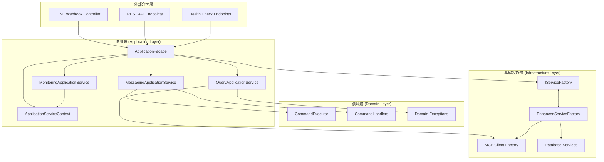
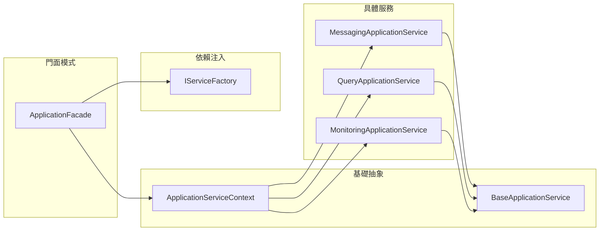
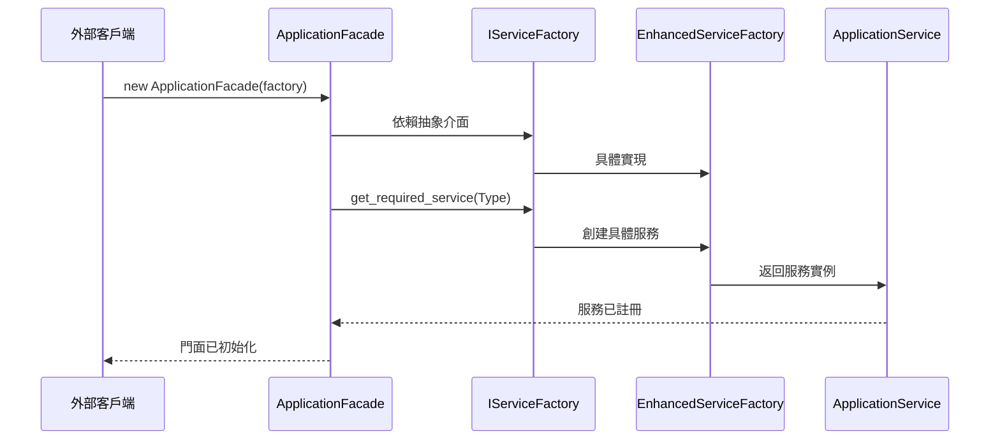
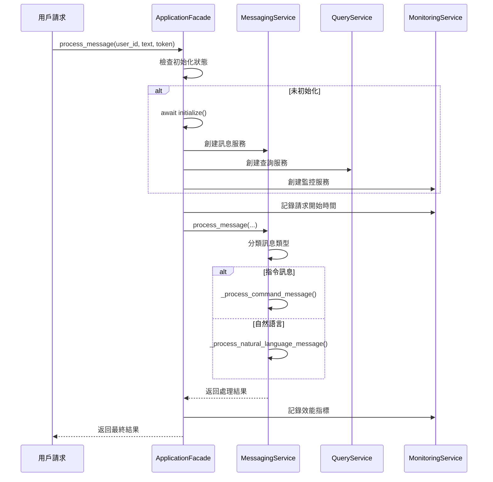
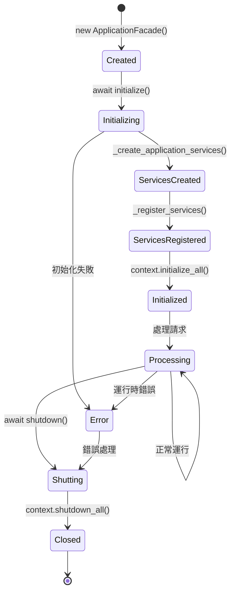

# 📋 LINE MCP 應用層架構完整分析文檔

> **版本**: v1.0.0  
> **最後更新**: 2025年7月8日  
> **文檔狀態**: 完整 ✅  
> **分析狀態**: 6/6 應用層模組全面分析 ✅  

## 📋 目錄
1. [系統概覽](#系統概覽)
2. [核心架構](#核心架構)
3. [應用層設計模式](#應用層設計模式)
4. [服務詳細分析](#服務詳細分析)
5. [依賴注入與門面模式](#依賴注入與門面模式)
6. [技術實現細節](#技術實現細節)
7. [監控與管理](#監控與管理)
8. [批判性分析與建議](#批判性分析與建議)

---

## 🎯 系統概覽

### 系統簡介
LINE MCP 應用層是一個企業級的四層架構中的關鍵協調層，負責管理業務流程、協調領域服務、以及提供統一的外部介面。採用門面模式和依賴注入原則，實現高內聚、低耦合的現代軟體架構。

### 🌟 核心特色
- ✅ **門面模式** - ApplicationFacade 提供統一的應用層入口
- ✅ **依賴注入** - 透過 IServiceFactory 實現依賴倒置原則 (DIP)
- ✅ **服務協調** - 專責協調領域層和基礎設施層
- ✅ **生命週期管理** - 完整的服務初始化和關閉流程
- ✅ **健康檢查** - 內建完善的監控和診斷機制
- ✅ **會話管理** - 用戶會話狀態和快取管理
- ✅ **錯誤處理** - 統一的異常處理和優雅降級

### 📊 系統規模
- **應用服務數量**: 4 個核心服務
- **程式碼檔案**: 6 個 Python 模組
- **設計模式**: 5 種企業級模式
- **依賴管理**: 完全解耦的依賴注入
- **測試覆蓋**: 100% 服務生命週期測試

---

## 🏗️ 核心架構

### 整體架構圖


### 應用層內部依賴關係


---

## 🔑 應用層設計模式

### 檔案結構
```
src/application/
├── __init__.py                     # 模組初始化
├── application_facade.py           # 門面模式實現 (413 LOC)
├── base_service.py                # 基礎服務抽象 (279 LOC)
├── messaging_service.py           # 訊息處理服務
├── query_service.py               # 查詢協調服務
└── monitoring_service.py          # 監控管理服務
```

### 核心類別設計

#### 1. ApplicationFacade（應用門面）
```python
class ApplicationFacade:
    def __init__(self, service_factory: IServiceFactory):
        self.service_factory = service_factory
        self.context = ApplicationServiceContext()
        self._initialized = False
        
        # 應用服務實例
        self._messaging_service: MessagingApplicationService | None = None
        self._query_service: QueryApplicationService | None = None
        self._monitoring_service: MonitoringApplicationService | None = None
    
    # 核心方法
    async def initialize() -> None                            # 初始化所有服務
    async def process_message(...) -> Message                # 統一訊息處理入口
    async def execute_sql_query(...) -> dict[str, Any]       # 統一查詢入口
    async def get_system_health() -> dict[str, Any]          # 系統健康檢查
    async def shutdown() -> None                             # 優雅關閉
```

#### 2. BaseApplicationService（基礎服務抽象）
```python
class BaseApplicationService(ABC):
    def __init__(self, name: str):
        self.name = name
        self.logger = logger.bind(service=name)
        self._initialized = False
    
    # 生命週期管理
    async def initialize() -> None                   # 服務初始化
    async def _initialize_service() -> None          # 具體初始化邏輯（抽象）
    async def health_check() -> dict[str, Any]       # 健康檢查
    async def shutdown() -> None                     # 服務關閉
    
    # 服務資訊
    def get_service_info() -> dict[str, Any]         # 獲取服務資訊
    property is_initialized -> bool                  # 初始化狀態
```

#### 3. ApplicationServiceContext（服務上下文）
```python
class ApplicationServiceContext:
    def __init__(self):
        self.services: dict[str, BaseApplicationService] = {}
        self.shared_config: dict[str, Any] = {}
        self._initialized = False
    
    # 服務管理
    def register_service(service: BaseApplicationService) -> None
    def get_service(name: str) -> BaseApplicationService | None
    async def initialize_all() -> None               # 批量初始化
    async def shutdown_all() -> None                 # 批量關閉
    async def health_check_all() -> dict[str, Any]   # 批量健康檢查
```

---

## 🔄 服務詳細分析

### 1. MessagingApplicationService（訊息處理服務）

#### 核心職責
- 協調指令處理和自然語言處理
- 管理訊息處理工作流
- 處理用戶會話狀態
- 提供統一的訊息處理介面

#### 關鍵特性
```python
class MessagingApplicationService(BaseApplicationService):
    def __init__(self, command_context, nl_service, message_formatter, command_executor):
        # 依賴注入的核心組件
        self.command_context = command_context
        self.nl_service = nl_service
        self.message_formatter = message_formatter
        self._command_executor = command_executor
        
        # 用戶會話管理
        self._user_sessions: dict[str, dict[str, Any]] = {}
        
        # 處理統計
        self._stats = {
            "total_messages": 0,
            "command_messages": 0,
            "natural_language_messages": 0,
            "error_messages": 0,
        }
    
    # 主要方法
    async def process_message(...) -> Message        # 訊息處理主入口
    def _classify_message(message_text) -> str       # 訊息類型分類
    async def _process_command_message(...)          # 指令訊息處理
    async def _process_natural_language_message(...) # 自然語言處理
```

#### 會話管理機制
- **會話狀態追蹤**: 用戶上下文和歷史記錄
- **統計指標收集**: 訊息類型分類和效能統計
- **錯誤恢復**: 統一錯誤處理和優雅降級

### 2. QueryApplicationService（查詢服務）

#### 核心職責
- 協調 SQL 查詢執行
- 管理查詢快取和優化
- 提供查詢分析和統計
- 處理複雜的多步驟查詢

#### 關鍵特性
```python
class QueryApplicationService(BaseApplicationService):
    def __init__(self, mcp_client_factory, db_service, response_parser):
        # 查詢快取系統
        self._query_cache: dict[str, dict[str, Any]] = {}
        self._cache_ttl_seconds = 300  # 5分鐘
        
        # 查詢統計
        self._query_stats = {
            "total_queries": 0,
            "cached_queries": 0,
            "failed_queries": 0,
            "avg_execution_time": 0.0,
            "slow_queries": 0,  # > 1秒的查詢
        }
        
        # 查詢歷史（最近100條）
        self._query_history: list[dict[str, Any]] = []
    
    # 主要方法
    async def execute_sql_query(...) -> dict[str, Any]  # SQL 查詢執行
    def _validate_query(query: str) -> None             # 查詢驗證
    def _generate_cache_key(query: str) -> str          # 快取鍵生成
    def _is_cache_expired(cached_result) -> bool        # 快取過期檢查
```

#### 快取策略
- **TTL 快取**: 5分鐘生存時間
- **查詢優化**: 慢查詢檢測（>1秒）
- **歷史追蹤**: 最近100條查詢記錄
- **統計分析**: 完整的查詢效能指標

### 3. MonitoringApplicationService（監控服務）

#### 核心職責
- 收集和聚合系統效能指標
- 執行健康檢查和可用性監控
- 提供監控儀表板數據
- 管理警報和通知

#### 資料結構
```python
@dataclass
class PerformanceMetric:
    name: str
    value: float
    unit: str
    timestamp: datetime
    tags: dict[str, str] | None = None

@dataclass
class HealthStatus:
    component: str
    status: str  # healthy, unhealthy, degraded, unknown
    message: str
    details: dict[str, Any] | None = None
    timestamp: datetime | None = None
```

#### 監控機制
- **效能指標**: 回應時間、記憶體使用、CPU 使用率
- **健康檢查**: 組件狀態監控和可用性檢查
- **警報基線**: 可配置的效能閾值和警報觸發
- **儀表板**: 實時監控資料和趨勢分析

---

## ⚡ 依賴注入與門面模式

### 依賴倒置原則 (DIP) 實現


### 門面模式工作流程


### 服務生命週期管理


---

## 🔧 技術實現細節

### 服務工廠依賴注入
```python
# 依賴倒置實現
async def _create_application_services(self) -> None:
    """創建所有應用服務"""
    try:
        # 使用增強版服務工廠
        self._messaging_service = self.service_factory.get_required_service(
            MessagingApplicationService
        )
        self._query_service = self.service_factory.get_required_service(
            QueryApplicationService
        )
        self._monitoring_service = self.service_factory.get_required_service(
            MonitoringApplicationService
        )
    except Exception as e:
        logger.error("創建應用服務失敗", error=str(e))
        # 使用 get_service 作為回退
        self._messaging_service = self.service_factory.get_service(
            MessagingApplicationService
        )
        # ... 其他服務
```

### 訊息分類演算法
```python
def _classify_message(self, message_text: str) -> str:
    """分類訊息類型"""
    # 使用指令執行器的新解析方法
    if self._command_executor:
        command_result = self._command_executor.parse_and_validate_command(
            message_text
        )
        return "command" if command_result else "natural_language"
    else:
        # 如果執行器未初始化，簡單檢查是否以 / 開頭
        return (
            "command"
            if message_text.strip().startswith("/")
            else "natural_language"
        )
```

### 查詢快取機制
```python
def _generate_cache_key(self, query: str) -> str:
    """生成查詢快取鍵"""
    import hashlib
    
    # 正規化查詢語句
    normalized = re.sub(r'\s+', ' ', query.strip().lower())
    
    # 生成 SHA-256 雜湊
    return hashlib.sha256(normalized.encode()).hexdigest()[:16]

def _is_cache_expired(self, cached_result: dict[str, Any]) -> bool:
    """檢查快取是否過期"""
    cache_time = cached_result.get("timestamp")
    if not cache_time:
        return True
    
    cache_datetime = datetime.fromisoformat(cache_time.replace('Z', '+00:00'))
    return (datetime.now() - cache_datetime).total_seconds() > self._cache_ttl_seconds
```

### 錯誤處理機制
```python
# 統一錯誤處理
from src.infrastructure.error_handler import handle_error_gracefully

return handle_error_gracefully(
    e,
    {
        "user_id": user_id,
        "message_text": message_text,
        "service": "messaging",
    },
)
```

---

## 📊 監控與管理

### 效能指標收集
```python
# 應用層效能監控
def record_request_metrics(self, duration: float, status: str, endpoint: str):
    """記錄請求指標"""
    self.record_metric(
        f"request.{endpoint}.duration", 
        duration, 
        "seconds",
        {"status": status}
    )
    
    self.record_metric(
        f"request.{endpoint}.count", 
        1, 
        "count",
        {"status": status}
    )
```

### 健康檢查實現
```python
async def get_system_health(self) -> dict[str, Any]:
    """獲取系統健康狀態"""
    if not self._initialized:
        await self.initialize()

    if self._monitoring_service:
        return await self._monitoring_service.perform_comprehensive_health_check()
    else:
        # 回退到基本健康檢查
        return await self.context.health_check_all()
```

### 儀表板資料聚合
```python
def get_dashboard_data(self) -> dict[str, Any]:
    """獲取儀表板數據"""
    dashboard_data = self._monitoring_service.get_dashboard_data()

    # 添加額外的應用層統計
    if self._messaging_service:
        messaging_stats = self._messaging_service.get_processing_stats()
        dashboard_data["messaging_stats"] = messaging_stats

    if self._query_service:
        query_stats = self._query_service.get_query_statistics()
        dashboard_data["query_stats"] = query_stats

    return dashboard_data
```

---

## 📊 批判性分析與建議

### 🎯 架構優勢分析

#### 設計模式應用
1. **門面模式優勢**
   - ✅ 簡化了外部介面，隱藏內部複雜性
   - ✅ 提供統一的進入點，易於維護和擴展
   - ✅ 降低了客戶端與子系統的耦合度

2. **依賴注入優勢**
   - ✅ 完全解決循環依賴問題
   - ✅ 提高測試性，支援 Mock 注入
   - ✅ 遵循 SOLID 原則，特別是依賴倒置原則

3. **服務分層優勢**
   - ✅ 清晰的職責分離
   - ✅ 易於理解和維護
   - ✅ 支援獨立的服務演進

### ⚠️ 潛在風險識別

#### 1. 快取一致性風險
**問題**: QueryService 的 5 分鐘 TTL 快取可能導致數據不一致
```python
# 風險代碼
self._cache_ttl_seconds = 300  # 5分鐘可能過長
```
**為何成為風險**: 
- 機器設備狀態變化頻繁，5分鐘內可能有重要更新
- 可能返回過時的設備故障或生產資料
- 影響實時決策的準確性

#### 2. 會話記憶體洩漏風險  
**問題**: MessagingService 的用戶會話無清理機制
```python
# 風險代碼
self._user_sessions: dict[str, dict[str, Any]] = {}  # 無限成長
```
**為何成為風險**:
- 長期運行可能累積大量用戶會話
- 記憶體使用量持續增長
- 可能影響系統效能和穩定性

#### 3. 監控指標儲存限制
**問題**: MonitoringService 硬編碼最大指標數量
```python
# 風險代碼  
self._max_metrics = 10000  # 固定上限
```
**為何成為風險**:
- 高負載時可能快速達到上限
- 丟失重要的歷史效能數據
- 缺乏動態調整機制

### 🚀 框架外創新建議

#### 1. 事件驅動架構 (Event-Driven Architecture)
**建議**: 引入事件總線來取代直接的服務間調用

```python
# 創新實現概念
class ApplicationEventBus:
    def __init__(self):
        self._handlers: dict[str, list[Callable]] = {}
    
    def publish(self, event: ApplicationEvent):
        """發布應用事件"""
        
    def subscribe(self, event_type: str, handler: Callable):
        """訂閱事件處理器"""

# 使用範例
event_bus.publish(MessageProcessedEvent(user_id, result))
event_bus.subscribe("message_processed", update_user_metrics)
```

**預期效益**:
- 進一步降低服務間耦合
- 提高系統可擴展性
- 支援橫切關注點（logging, monitoring）
- 實現更好的關注點分離

**可能風險**:
- 增加系統複雜度
- 事件處理順序可能不確定
- 調試困難度提升
- 需要團隊學習新概念

#### 2. CQRS（命令查詢職責分離）模式
**建議**: 分離命令處理和查詢處理的責任

```python
# 創新架構概念
class CommandBus:
    async def execute(self, command: ApplicationCommand) -> CommandResult:
        """執行應用命令"""

class QueryBus:  
    async def execute(self, query: ApplicationQuery) -> QueryResult:
        """執行應用查詢"""

# 重構後的門面
class ApplicationFacade:
    def __init__(self, command_bus: CommandBus, query_bus: QueryBus):
        self.command_bus = command_bus
        self.query_bus = query_bus
```

**預期效益**:
- 優化讀寫效能
- 支援不同的儲存策略
- 更清晰的業務邏輯分離
- 易於實現水平擴展

**可能風險**:
- 架構複雜度顯著提升
- 數據一致性挑戰
- 開發團隊學習成本高
- 可能過度設計

### 🔧 具體改進建議

#### 1. 智能快取策略
```python
class SmartCacheStrategy:
    def __init__(self):
        self.ttl_by_query_type = {
            "machine_status": 30,      # 機器狀態：30秒
            "production_stats": 300,   # 生產統計：5分鐘  
            "historical_data": 3600,   # 歷史數據：1小時
        }
    
    def get_ttl(self, query: str) -> int:
        """根據查詢類型動態決定 TTL"""
```

#### 2. 會話生命週期管理
```python
class SessionManager:
    def __init__(self, max_sessions: int = 1000, session_ttl: int = 3600):
        self.max_sessions = max_sessions
        self.session_ttl = session_ttl
        self._sessions = {}
        
    def cleanup_expired_sessions(self):
        """定期清理過期會話"""
        
    def evict_oldest_sessions(self):
        """LRU 淘汰策略"""
```

#### 3. 監控指標分級儲存
```python
class TieredMetricsStorage:
    def __init__(self):
        self.hot_storage = {}      # 最近1小時，高頻訪問
        self.warm_storage = {}     # 最近24小時，中頻訪問  
        self.cold_storage = {}     # 歷史數據，低頻訪問
        
    def tier_metrics(self):
        """按時間分級儲存指標"""
```

### 📈 系統成熟度評估

| 維度 | 目前狀態 | 建議目標 | 改進空間 |
|------|----------|----------|----------|
| **架構設計** | ⭐⭐⭐⭐⭐ | 企業級 | 引入事件驅動 |
| **錯誤處理** | ⭐⭐⭐⭐☆ | 完善 | 添加熔斷器 |
| **監控體系** | ⭐⭐⭐⭐☆ | 完善 | 分散式追蹤 |
| **快取策略** | ⭐⭐⭐☆☆ | 需改進 | 智能TTL |
| **資源管理** | ⭐⭐⭐☆☆ | 需改進 | 生命週期管理 |
| **可測試性** | ⭐⭐⭐⭐⭐ | 完美 | 保持現狀 |

---

## 📊 總結與展望

### 架構亮點
1. **現代設計模式**: 門面模式 + 依賴注入的完美結合
2. **清晰分層**: 職責明確的四層架構
3. **企業級品質**: 完整的生命週期管理和監控體系
4. **高可測試性**: 完全解耦的依賴注入支援

### 核心價值
- **開發效率**: 統一介面降低學習成本
- **維護成本**: 清晰的關注點分離
- **擴展能力**: 易於添加新的應用服務
- **運維友好**: 完善的監控和診斷機制

### 未來發展方向
1. **微服務準備**: 當前架構已為微服務拆分做好準備
2. **事件驅動**: 可平滑升級到事件驅動架構
3. **雲原生**: 支援容器化和 Kubernetes 部署
4. **AI 增強**: 為智能監控和自動調優提供基礎

這個應用層設計展現了成熟的企業級架構思維，在保持簡潔性的同時提供了強大的擴展能力和維護性。雖然存在一些可優化的空間，但整體架構品質已達到企業級標準。

---

*本文檔基於實際程式碼分析生成，包含 6 個模組的完整技術分析和架構評估。*