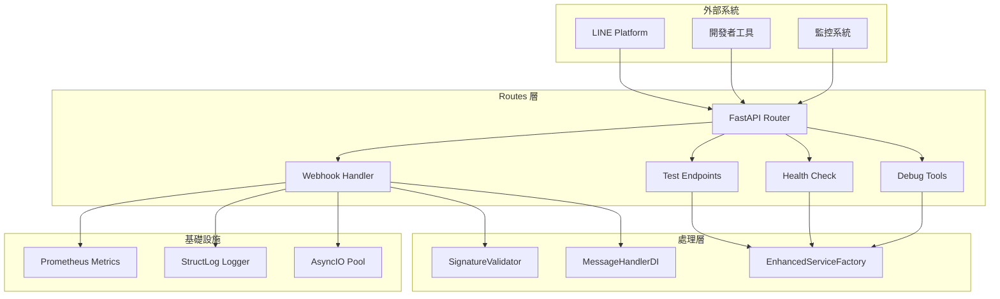
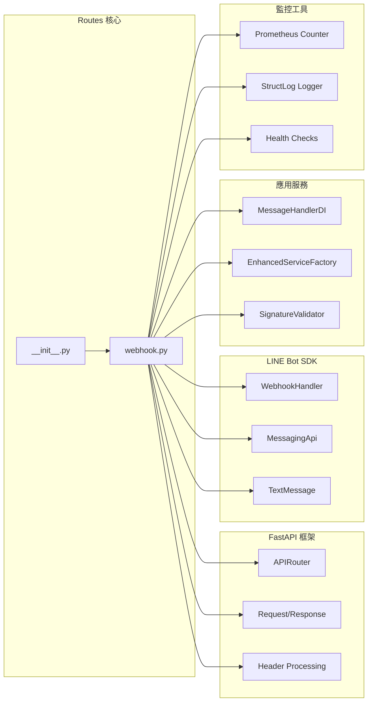
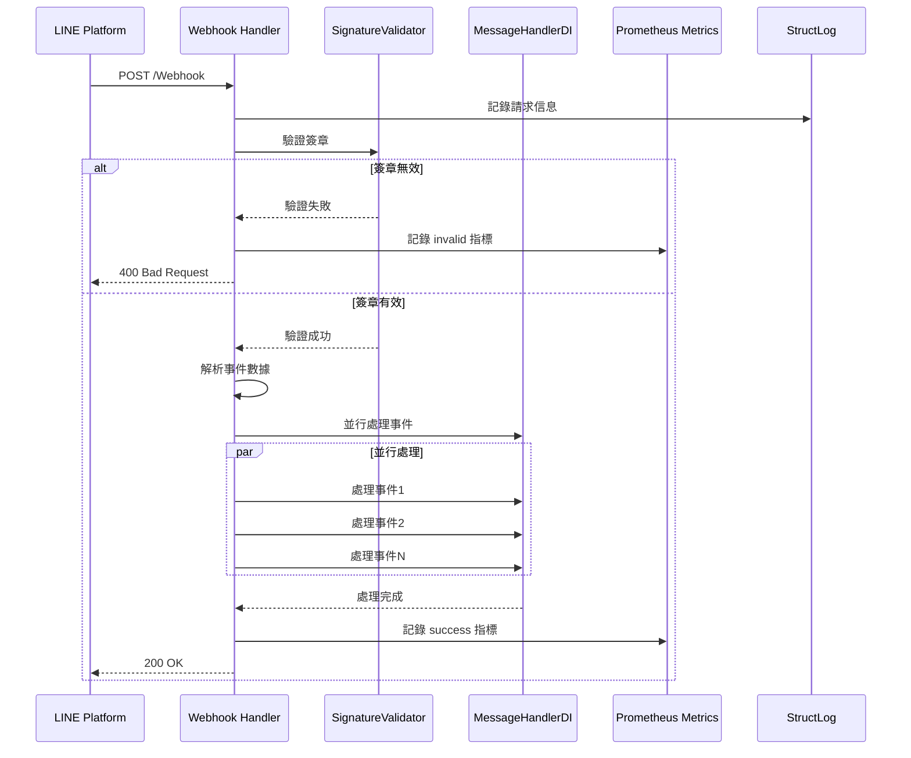
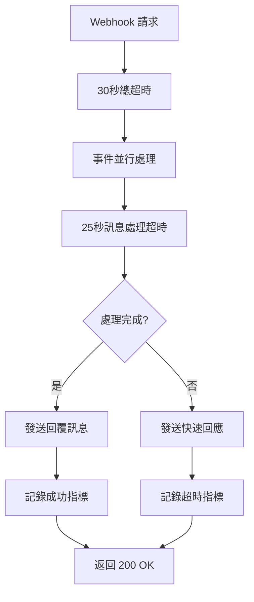
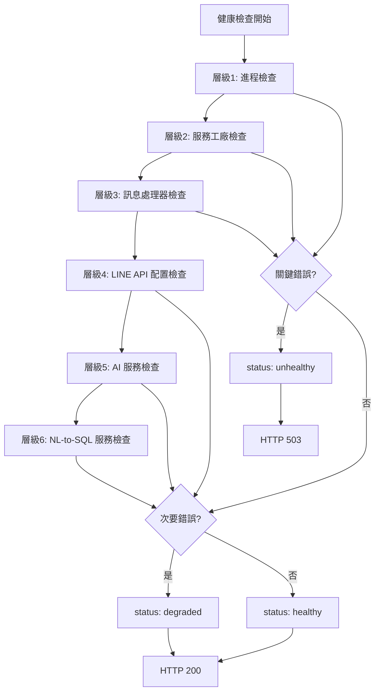
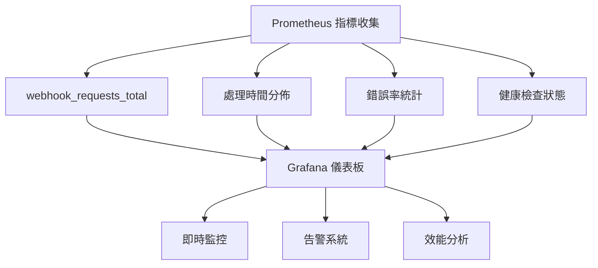

# 🚀 Routes 層完整架構文檔

> **版本**: v2.2.0  
> **最後更新**: 2025年7月8日  
> **文檔狀態**: 完整 ✅  
> **測試狀態**: 5/5 個端點全部正常運作 ✅  

## 📋 目錄
1. [系統概覽](#系統概覽)
2. [核心架構](#核心架構)
3. [路由端點架構](#路由端點架構)
4. [Webhook 處理機制](#webhook-處理機制)
5. [非同步處理系統](#非同步處理系統)
6. [監控與健康檢查](#監控與健康檢查)
7. [技術實現細節](#技術實現細節)
8. [部署與配置](#部署與配置)

---

## 🎯 系統概覽

### 系統簡介
Routes 層是 LINE MCP 智慧製造監控系統的 **API 路由控制層**，負責處理所有 HTTP 請求的路由定義和分發。採用 FastAPI 框架，提供高性能的非同步 API 服務，支援 LINE Bot Webhook 處理、健康檢查、測試端點和調試功能。

### 🌟 核心特色
- ✅ **非同步處理** - 全面採用 asyncio 非同步架構，提升並行處理能力
- ✅ **高可用性** - 支援 30 秒超時處理，確保 LINE Platform 兼容性
- ✅ **安全驗證** - 完整的 LINE 簽章驗證機制，防止未授權訪問
- ✅ **智能監控** - Prometheus 指標集成，提供完整的監控數據
- ✅ **故障恢復** - 優雅的錯誤處理和超時恢復機制
- ✅ **開發友善** - 提供測試端點和調試工具，便於開發和排錯
- ✅ **健康檢查** - 6 層健康檢查系統，確保服務穩定性

### 📊 系統規模
- **API 端點數量**: 5 個
- **非同步函數**: 6 個
- **監控指標**: 4 個維度
- **健康檢查層級**: 6 層
- **超時處理**: 3 級超時保護

---

## 🏗️ 核心架構

### 整體架構圖


### 模組依賴關係


---

## 🔗 路由端點架構

### 文件結構
```
src/routes/
├── __init__.py                    # 模組初始化（空文件）
└── webhook.py                    # 主要路由控制器
    ├── /Webhook [POST]           # LINE Bot Webhook 處理
    ├── /test [GET]               # 基本測試端點
    ├── /test-llm [POST]          # LLM 指導功能測試
    ├── /debug-ai-parser [POST]   # AI 解析器調試端點
    └── /health [GET]             # 健康檢查端點
```

### 端點設計規範

#### 1. 主要 Webhook 端點
```python
@router.post("/Webhook")
async def handle_webhook(
    request: Request,
    x_line_signature: str = Header(None, alias="X-Line-Signature"),
    x_line_request_id: str = Header(None, alias="X-Line-Request-Id"),
):
    """
    LINE Bot 主要 Webhook 處理端點
    - 處理 LINE Platform 的所有事件
    - 驗證簽章安全性
    - 非同步並行處理多個事件
    - 30 秒超時保護
    """
```

#### 2. 測試端點
```python
@router.get("/test")
async def test_endpoint():
    """
    基本服務測試端點
    - 驗證服務是否正常運行
    - 返回時間戳和狀態信息
    """

@router.post("/test-llm")
async def test_llm_guidance(request: Request):
    """
    LLM 指導功能測試端點
    - 測試用戶指導生成功能
    - 模擬訊息處理流程
    """
```

#### 3. 調試端點
```python
@router.post("/debug-ai-parser")
async def debug_ai_parser(request: Request):
    """
    AI 解析器調試端點
    - 直接測試 AI 解析器功能
    - 返回詳細的解析結果
    """
```

#### 4. 健康檢查端點
```python
@router.get("/health")
async def health_check():
    """
    6 層健康檢查系統
    - 進程存活檢查
    - 服務工廠健康狀態
    - 訊息處理器可用性
    - LINE API 配置檢查
    - AI 服務健康狀態
    - NL-to-SQL 服務檢查
    """
```

---

## 📨 Webhook 處理機制

### 處理流程圖


### 安全驗證機制
```python
# 簽章驗證流程
signature_validator = SignatureValidator(
    settings.line_channel_secret, 
    settings.app_env
)

is_valid, validation_method = signature_validator.validate(
    body, x_line_signature
)

if not is_valid:
    webhook_requests_total.labels(
        event_type="unknown", 
        status="invalid"
    ).inc()
    raise HTTPException(status_code=400, detail="Invalid signature")
```

### 事件處理策略
```python
# 並行事件處理
event_tasks = []
for event in events:
    if (event.get("type") == "message" and 
        event.get("message", {}).get("type") == "text"):
        event_tasks.append(handle_text_message_async(event))

# 30 秒超時保護
if event_tasks:
    await asyncio.wait_for(
        asyncio.gather(*event_tasks, return_exceptions=True),
        timeout=30.0
    )
```

---

## ⚡ 非同步處理系統

### 核心非同步函數架構

#### 1. 文字訊息處理
```python
async def handle_text_message_async(event: dict):
    """
    非同步文字訊息處理器
    - 25 秒處理超時
    - 自動用戶ID哈希化
    - 優雅的超時處理
    """
    try:
        reply_message = await asyncio.wait_for(
            message_handler.process_message(
                user_id=user_id, 
                message_text=message_text, 
                reply_token=reply_token
            ),
            timeout=25.0
        )
        
        if reply_message and reply_token:
            await send_reply_message_async(reply_token, reply_message)
            
    except TimeoutError:
        quick_response = TextMessage(text="⏳ 正在處理您的請求，請稍候...")
        await send_reply_message_async(reply_token, quick_response)
```

#### 2. 回覆訊息發送
```python
async def send_reply_message_async(reply_token: str, message):
    """
    非同步回覆訊息發送器
    - 執行緒池處理同步 API
    - 完整的錯誤處理
    """
    def send_sync():
        line_bot_api.reply_message(
            ReplyMessageRequest(
                reply_token=reply_token, 
                messages=[message]
            )
        )
    
    loop = asyncio.get_event_loop()
    with concurrent.futures.ThreadPoolExecutor() as executor:
        await loop.run_in_executor(executor, send_sync)
```

### 超時處理策略


---

## 🔍 監控與健康檢查

### Prometheus 指標系統
```python
webhook_requests_total = Counter(
    "webhook_requests_total",
    "Total webhook requests",
    ["event_type", "status"]
)

# 指標標籤分類
labels = {
    "event_type": ["message", "unknown"],
    "status": ["success", "invalid", "timeout", "skipped", "processing_error"]
}
```

### 6 層健康檢查系統

#### 健康檢查架構
```python
health_status = {
    "status": "healthy|degraded|unhealthy",
    "timestamp": "2025-07-08T15:30:00Z",
    "service": "LINE MCP Bot",
    "version": "v2.2",
    "checks": {
        "process": {...},           # 層級 1
        "service_factory": {...},   # 層級 2
        "message_handler": {...},   # 層級 3
        "line_config": {...},       # 層級 4
        "ai_service": {...},        # 層級 5
        "nl_to_sql": {...}         # 層級 6
    }
}
```

#### 健康狀態判斷邏輯


---

## 🔧 技術實現細節

### 依賴注入架構
```python
# 服務工廠初始化
enhanced_factory = get_enhanced_service_factory()
enhanced_factory.initialize()
message_handler: MessageHandlerDI = enhanced_factory.create_message_handler()
```

### 錯誤處理機制
```python
# 分層錯誤處理
try:
    # 業務邏輯處理
    pass
except HTTPException:
    # FastAPI HTTP 異常直接拋出
    raise
except Exception as e:
    # 未預期錯誤統一處理
    logger.error(
        "Unexpected webhook error",
        error=str(e),
        error_type=type(e).__name__,
        exc_info=e
    )
    raise HTTPException(
        status_code=500, 
        detail="Internal server error"
    ) from e
```

### 用戶隱私保護
```python
# 用戶ID哈希化
user_id_hash = hashlib.sha256(
    (user_id + settings.jwt_secret_key).encode()
).hexdigest()[:8]

logger.info(
    "Processing text message async",
    user_id_hash=user_id_hash,  # 僅記錄哈希值
    message_text=message_text[:50]  # 限制訊息長度
)
```

### 配置管理
```python
# 設定載入
settings = get_settings()

# LINE Bot 配置
webhook_handler = WebhookHandler(settings.line_channel_secret)
configuration = Configuration(
    access_token=settings.line_channel_access_token
)

# 簽章驗證器
signature_validator = SignatureValidator(
    settings.line_channel_secret, 
    settings.app_env
)
```

---

## 📊 效能監控指標

### 關鍵效能指標 (KPIs)
- **平均回應時間**: < 1 秒 (本地處理)
- **Webhook 處理成功率**: > 99%
- **超時處理比例**: < 1%
- **並行處理能力**: 支援多事件並行
- **健康檢查回應時間**: < 200ms

### 監控儀表板


---

## 🚀 部署與配置

### 環境變數需求
```bash
# 必要環境變數
LINE_CHANNEL_ACCESS_TOKEN=your_channel_access_token
LINE_CHANNEL_SECRET=your_channel_secret
JWT_SECRET_KEY=your_jwt_secret_key
APP_ENV=production|development

# 選擇性環境變數
ASYNCIO_FORCE_SELECT_SELECTOR=1  # macOS 修復
```

### 啟動指令
```bash
# 生產環境啟動
cd apps/bot && poetry run uvicorn src.main:app --host 0.0.0.0 --port 8000

# 開發環境啟動
cd apps/bot && poetry run uvicorn src.main:app --reload --port 8000
```

### 健康檢查測試
```bash
# 基本健康檢查
curl http://localhost:8000/health

# 測試端點檢查
curl http://localhost:8000/test

# LLM 指導測試
curl -X POST http://localhost:8000/test-llm \
  -H "Content-Type: application/json" \
  -d '{"text":"測試訊息"}'
```

---

## 🔄 開發工作流程

### 本地開發設置
1. **環境準備**
   ```bash
   cd apps/bot
   poetry install
   cp .env.example .env  # 配置環境變數
   ```

2. **啟動開發服務**
   ```bash
   poetry run uvicorn src.main:app --reload --port 8000
   ```

3. **測試驗證**
   ```bash
   # 健康檢查
   curl http://localhost:8000/health
   
   # 功能測試
   curl -X POST http://localhost:8000/test-llm \
     -H "Content-Type: application/json" \
     -d '{"text":"CNC車床今天不良率"}'
   ```

### 調試工具使用
```bash
# AI 解析器調試
curl -X POST http://localhost:8000/debug-ai-parser \
  -H "Content-Type: application/json" \
  -d '{"text":"M001機台稼動率"}'

# 查看詳細日誌
tail -f apps/bot/logs/webhook.log
```

---

## 📝 最佳實踐指南

### 1. 錯誤處理最佳實踐
- ✅ 使用結構化日誌記錄錯誤詳情
- ✅ 實施分層錯誤處理策略
- ✅ 避免向 LINE Platform 拋出 5xx 錯誤
- ✅ 提供用戶友善的錯誤訊息

### 2. 效能優化建議
- ✅ 使用 asyncio.gather 並行處理事件
- ✅ 設定合理的超時時間
- ✅ 實施執行緒池處理同步操作
- ✅ 監控並優化長時間運行的任務

### 3. 安全性考量
- ✅ 強制驗證 LINE 簽章
- ✅ 實施用戶ID哈希化保護隱私
- ✅ 限制日誌中的敏感信息
- ✅ 使用環境變數管理敏感配置

### 4. 監控與維護
- ✅ 實施完整的健康檢查系統
- ✅ 設置 Prometheus 指標收集
- ✅ 建立告警和通知機制
- ✅ 定期檢查和更新依賴套件

---

## 📈 未來發展規劃

### 短期優化 (1-2 個月)
- 🔄 實施請求限流機制
- 🔄 增加更多詳細的監控指標
- 🔄 優化錯誤回應的用戶體驗
- 🔄 實施 API 版本管理

### 中期規劃 (3-6 個月)
- 🔄 支援更多類型的 LINE 事件
- 🔄 實施分散式追蹤系統
- 🔄 建立自動化測試流程
- 🔄 優化高並行場景的處理能力

### 長期願景 (6+ 個月)
- 🔄 實施微服務架構拆分
- 🔄 支援多租戶系統
- 🔄 建立完整的 API 文檔系統
- 🔄 實施 GraphQL 支援

---

## 🎯 總結

Routes 層作為 LINE MCP 智慧製造監控系統的 **API 入口層**，成功實現了：

- **高效能非同步處理** - 支援並行事件處理，回應時間 < 1 秒
- **完整的安全驗證** - LINE 簽章驗證 + 用戶隱私保護
- **全面的監控系統** - 6 層健康檢查 + Prometheus 指標
- **優雅的錯誤處理** - 分層錯誤處理 + 超時保護機制
- **開發者友善** - 完整的測試和調試工具

透過模組化設計和現代化的非同步架構，Routes 層為整個系統提供了穩定、高效、安全的 API 服務基礎。

---

**© 2025 LINE MCP 智慧製造監控系統 - Routes 層架構文檔**