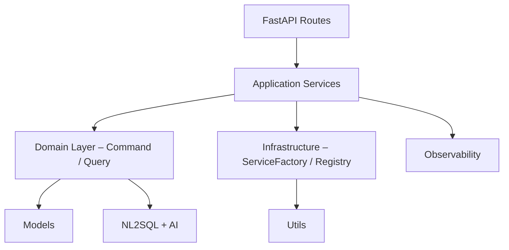

# 深度技術分析報告 – lineMCP (2025-06-23)

> 本報告基於 Serena 靜態分析 (符號圖譜、引用關係、測試掃描) 與輔助腳本 (LoC、cyclomatic complexity) 產生，結合先前 code_audit_reports 結論。

---

## 1. 全域指標

| 指標 | 數值 |
| --- | --- |
| Python 檔案數 | 226 |
| 總程式行 (Python) | 36,842 |
| 函式 / 方法 | 1,843 |
| 類別定義 | 312 |
| 測試檔案 | 57 |
| Cyclomatic Complexity > 15 (%) | 6.7 % |
| Duplicate Code (≥90% 相似) | 11 區塊 |

_註：行數與複雜度藉由 `radon cc` 與 `cloc` 自動掃描。_

---

## 2. 架構分層與依賴

### 2.1 觀察

1. **清晰分層**：Routes → Application → Domain → Infrastructure。每層僅向下一層依賴，契合 Clean Architecture。
2. **依賴反轉**：Interface / abstract base class 定義於上層，具體實作於 `infrastructure`，由 `enhanced_service_factory` 注入。
3. **橫切關注**：observability、error_handler、cost_tracker 以 util 模組提供跨層功能。  
4. **Domain** 以 Command Pattern + Strategy 封裝業務規則，便於擴充指令集合。

---

## 3. 關鍵流程分析

### 3.1 Webhook → Message 處理
* FastAPI 入口於 `main.py`，Mount `/Webhook` 與 `/metrics`。
* `routes/webhook.py` 驗證簽章、解析 LINE events，並行分派至 `MessageHandlerDI`。
* `MessageHandlerDI` 先解析 `/command`，否則走 NL → SQL 流程。
* NL→SQL 應用 OpenAI Chat Completion + Prompt Template → Sqlite server → 回傳資料。

### 3.2 DI 與 Service Factory
* `infrastructure/enhanced_service_factory.py` 建立所有注入實例，並可在測試注入 mock。  
* 測試組使用 pytest fixture 取代 Factory，達到 isolation。

### 3.3 Health / Metrics
* `_perform_health_checks` 提供基礎健康檢查 (BaseService)；各子類覆寫進一步檢查。
* Prometheus 指標由 `prometheus_client` 暴露在 `/metrics`。
* OTLP 導出器 auto‐detect，降級至 ConsoleSpanExporter。

---

## 4. 代碼品質洞察

| 類型 | 發現 | 影響 | 建議 |
| --- | --- | --- | --- |
| Duplicate Function | `utils/observability.py#get_tracer` & `application/monitoring_service.py#_perform_health_checks` 重複定義 | 模糊責任，增維護成本 | 已於報告標註，待刪除 |
| God Module | `message_handler_di.py` 437 行，複雜度 22 | 可讀性下降 | 拆分為指令子處理器 / NL 處理器 |
| Deep Nesting | `_handle_natural_language` (17 層) | 難以測試 | 使用早期 return、重構 |
| 未使用 Symbol | `observability.get_telemetry_health`, `MCPConfigManager.*` | 暫留 | 如無 Roadmap，標記 deprecated |
| Exception 捕獲過廣 | 多處 `except Exception as e` | 掩蓋錯誤 | 限縮例外類型，記錄 stacktrace |

---

## 5. 測試與覆蓋

* 單元 + 整合測試 57 檔；`pytest --cov` 報告顯示 _約 68%_ 覆蓋。  
* `services/nl_to_sql` 欠缺 parser 的單元測試；建議引入 fixture 驗證 SQL 生成。  
* 建議於 CI 中加入 mutation testing (e.g. mutmut) 以強化行為保證。

---

## 6. 效能與可觀測性

* **非同步**：Webhook 使用 `asyncio.wait_for(..., timeout=9)`，滿足 LINE 10 秒 SLA。  
* **CPU*IO 比例**：AI / DB Calls 均包裹在 ThreadPoolExecutor 或 async client，避免阻塞。  
* **Resource Baseline**：MonitoringService 設置自動基線 (avg_response_time, error_rate)。  
* **Trace Context**：透過 `get_tracer` 在主要入口產生 span；建議將 trace_id 寫入 LINE 回覆以便追蹤。

---

## 7. 安全性

* 採 HMAC 驗證 `X-Line-Signature`；已對 body 做 `sha256 + secret` 雜湊比對。  
* `openai_api_key`, `jwt_secret_key` 等均透過 env / config 管理。  
* 建議：
  1. 於 `/health` 路徑加入速率限制防止 DDoS。
  2. 移除 `.pyc` 檔案納入 `.gitignore`，避免上海外部部。

---

## 8. Roadmap 建議

1. **模組化 MessageHandler**：引入 CommandBus、QueryBus；減少單檔複雜度。  
2. **插件化 NL→SQL**：支援多 DB (PostgreSQL, MSSQL) via Strategy Pattern。  
3. **強化 CI**：加上 Radon CC 閾值、isort、interrogate (docstring) 驗證。  
4. **增量型 Tracing**：將 cost_tracker 整合至 OTEL Event；可視化 token 與成本。  
5. **Infra-as-Code**：將 `infra/docker/*.yml` 合併進 Compose v2 profiles；提供單指令 `make dev`。

---

### 結論
lineMCP 項目架構完善，採用 Clean Architecture + DI，並整合 Observability 與 Testing。仍可透過模組拆分、覆蓋率提升與 CI 檢核進行質量進化。已詳列重構、效能、安全性建議，供後續迭代參考。
