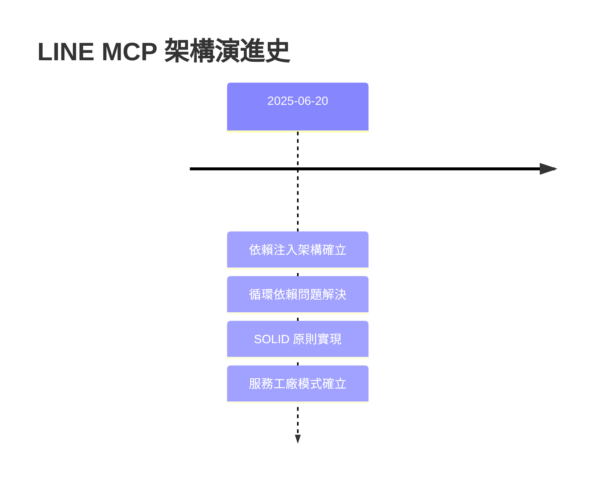

# 架構決策記錄 (Architecture Decision Records)

## 🎯 ADR 系統簡介

本目錄包含 LINE MCP 智慧製造監控系統的所有重要架構決策記錄。ADR (Architecture Decision Records) 是一種輕量級的文檔格式，用於記錄在系統開發過程中做出的重要架構決策。

## 🏗️ 為什麼使用 ADR？

- **📚 歷史追蹤**: 記錄決策的時間、背景和理由
- **🤝 知識共享**: 幫助新團隊成員理解系統設計思路
- **🔍 決策透明**: 明確記錄選擇某方案而非其他方案的原因
- **⚡ 快速參考**: 在需要時快速回顧過去的決策
- **🛡️ 風險管理**: 記錄已知的技術風險和限制

## 📋 ADR 索引

### 🔥 核心架構決策

| ADR | 標題 | 狀態 | 日期 | 影響範圍 |
|-----|------|------|------|----------|
| [001](./decisions/001-dependency-injection-architecture.md) | 依賴注入架構設計 | 接受 | 2025-06-20 | 整體架構 |
| [002](./decisions/002-circular-dependency-resolution.md) | 循環依賴解決方案 | 接受 | 2025-06-20 | 核心模組 |
| [003](./decisions/003-service-factory-pattern.md) | 服務工廠模式實現 | 接受 | 2025-06-20 | 服務層 |
| [004](./decisions/004-solid-principles-implementation.md) | SOLID 原則實現策略 | 接受 | 2025-06-20 | 設計原則 |

### 🚀 技術選型決策

| ADR | 標題 | 狀態 | 日期 | 影響範圍 |
|-----|------|------|------|----------|
| [005](./decisions/005-mcp-client-unification.md) | MCP 客戶端統一策略 | 提議 | 2025-06-20 | 客戶端層 |

## 🔄 決策狀態說明

- **✅ 接受**: 決策已被接受並實施
- **🔄 提議**: 決策尚在討論中
- **⚠️ 棄用**: 決策不再適用但保留記錄
- **🔄 被取代**: 被新的 ADR 取代

## 📖 如何使用 ADR

### 閱讀 ADR
1. 從本索引選擇相關的 ADR
2. 按照 ADR 編號順序閱讀了解演進過程
3. 注意 ADR 之間的關聯性和影響

### 創建新 ADR
1. 複製 [ADR 模板](./adr-template.md)
2. 使用下一個可用編號（格式：XXX-descriptive-title.md）
3. 填寫所有相關部分
4. 更新本索引文檔
5. 通過團隊審查

### ADR 編號規則
- 使用三位數編號：001, 002, 003...
- 按提案時間順序遞增
- 編號永不重複使用
- 即使 ADR 被棄用，編號也保留

## 🎯 架構演進時間軸

## 🔍 按主題分類

### 🏗️ 架構設計
- [ADR-001: 依賴注入架構設計](./decisions/001-dependency-injection-architecture.md)
- [ADR-002: 循環依賴解決方案](./decisions/002-circular-dependency-resolution.md)
- [ADR-004: SOLID 原則實現策略](./decisions/004-solid-principles-implementation.md)

### 🔧 設計模式
- [ADR-003: 服務工廠模式實現](./decisions/003-service-factory-pattern.md)

### 🌐 技術整合
- [ADR-005: MCP 客戶端統一策略](./decisions/005-mcp-client-unification.md) (提議)

## 📊 架構圖參考

- [依賴關係圖](./diagrams/before-after-dependency.mmd)
- [服務工廠層次圖](./diagrams/service-factory-hierarchy.mmd)

## 🤝 ADR 審查流程

1. **📝 起草**: 作者使用模板創建 ADR 草稿
2. **🔍 內部審查**: 團隊成員進行初步審查
3. **💬 討論**: 在團隊會議中討論決策選項
4. **✅ 批准**: 達成共識後更新狀態為「接受」
5. **📢 通知**: 更新相關文檔和通知相關團隊

## 🔗 相關資源

- [企業級架構最佳實務](https://docs.microsoft.com/en-us/azure/architecture/)
- [SOLID 原則詳解](https://www.digitalocean.com/community/conceptual_articles/s-o-l-i-d-the-first-five-principles-of-object-oriented-design)
- [依賴注入模式](https://martinfowler.com/articles/injection.html)
- [ADR 最佳實務](https://adr.github.io/)

## 📈 ADR 統計

- **總 ADR 數量**: 5 個 (4 已接受 + 1 提議)
- **最後更新**: 2025-06-20
- **涵蓋範圍**: 核心架構、設計模式、技術整合

---

*💡 建議新加入的開發者先閱讀核心架構決策 (ADR-001 到 ADR-004)，以快速了解系統的設計理念和架構原則。*