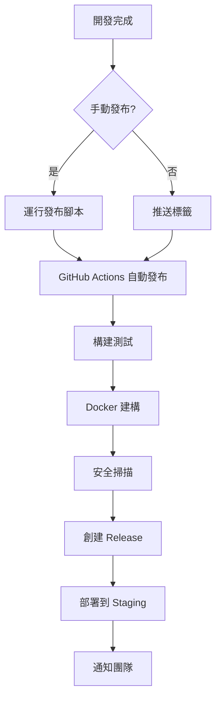

# 🚀 發布指南

本文檔說明如何使用自動化發布系統進行版本發布。

## 📋 發布流程概覽



## 🎯 發布方式

### 1. 自動發布（推薦）

#### 1.1 推送標籤觸發
```bash
# 手動創建標籤
git tag v1.2.3
git push origin v1.2.3

# 使用版本管理腳本
python scripts/version-manager.py release --type patch
git push origin main
git push origin v1.2.3
```

#### 1.2 GitHub Actions 手動觸發
1. 前往 GitHub Repository → Actions
2. 選擇 "🚀 Release Automation" 工作流程
3. 點擊 "Run workflow"
4. 選擇版本升級類型：
   - `patch`: 錯誤修復 (1.0.0 → 1.0.1)
   - `minor`: 新功能 (1.0.0 → 1.1.0)
   - `major`: 重大變更 (1.0.0 → 2.0.0)
5. 可選：添加自定義發布說明

### 2. 手動發布

```bash
# 檢查當前狀態
python scripts/version-manager.py status

# 乾跑模式（預覽變更）
python scripts/version-manager.py release --type patch --dry-run

# 執行發布
python scripts/version-manager.py release --type patch
```

## 📦 版本號規則

採用 [語義化版本控制](https://semver.org/lang/zh-TW/)：

### 格式：MAJOR.MINOR.PATCH

- **MAJOR**：不向下相容的重大變更
- **MINOR**：向下相容的新功能
- **PATCH**：向下相容的錯誤修復

### 提交訊息約定

```bash
feat: 新功能          → minor 版本升級
fix: 錯誤修復         → patch 版本升級
docs: 文檔更新        → patch 版本升級
style: 格式化變更     → patch 版本升級
refactor: 代碼重構    → patch 版本升級
perf: 效能優化       → patch 版本升級
test: 測試相關       → patch 版本升級
chore: 雜項任務      → patch 版本升級

BREAKING CHANGE: 重大變更 → major 版本升級
```

## 🔄 發布工作流程

### 自動執行步驟

1. **版本升級** 📈
   - 自動計算新版本號
   - 更新 `pyproject.toml`
   - 生成 changelog

2. **建構測試** 🔨
   - 執行完整測試套件
   - 生成測試覆蓋率報告
   - 建構 Python 套件

3. **Docker 建構** 🐳
   - 多平台建構 (amd64, arm64)
   - 推送到 GitHub Container Registry
   - 標記最新版本

4. **安全掃描** 🔒
   - Trivy 容器安全掃描
   - 上傳 SARIF 報告到 GitHub
   - 檢查已知漏洞

5. **創建 Release** 🎉
   - 自動生成發布說明
   - 上傳建構產物
   - 創建 GitHub Release

6. **部署 Staging** 🚀
   - 自動部署到測試環境
   - 運行煙霧測試
   - 驗證部署健康狀態

7. **通知團隊** 📬
   - 發送成功/失敗通知
   - 更新部署狀態
   - 記錄發布指標

## 📋 發布前檢查清單

### 開發完成
- [ ] 所有功能已實現並測試
- [ ] 代碼已通過 CI 檢查
- [ ] 文檔已更新
- [ ] 破壞性變更已記錄

### 測試驗證
- [ ] 單元測試通過 (>90% 覆蓋率)
- [ ] 整合測試通過
- [ ] 效能測試無退化
- [ ] 安全掃描無高風險問題

### 版本準備
- [ ] 確認版本升級類型正確
- [ ] 檢查 CHANGELOG.md 是否完整
- [ ] 環境變數文檔已更新
- [ ] API 文檔已更新

## 🛠️ 發布腳本使用

### 檢查狀態
```bash
python scripts/version-manager.py status
```

輸出示例：
```
📊 版本狀態
當前版本: 0.1.0
最新標籤: v0.1.0

📝 自 v0.1.0 以來的變更 (5 個提交):
  features: 2 個提交
  fixes: 1 個提交
  docs: 2 個提交
```

### 預覽發布
```bash
python scripts/version-manager.py release --type minor --dry-run
```

### 執行發布
```bash
python scripts/version-manager.py release --type minor
```

## 🐳 Docker 映像

### 標籤策略
- `latest`: 最新穩定版本
- `v1.2.3`: 特定版本標籤
- `main`: 主分支最新建構

### 使用映像
```bash
# 拉取最新版本
docker pull ghcr.io/your-org/line-mcp-bot:latest

# 拉取特定版本
docker pull ghcr.io/your-org/line-mcp-bot:v1.2.3

# 運行容器
docker run -d --name line-mcp-bot \
  -p 8000:8000 \
  --env-file .env \
  ghcr.io/your-org/line-mcp-bot:latest
```

## 🚨 緊急發布

### Hotfix 流程
```bash
# 從問題版本創建 hotfix 分支
git checkout -b hotfix/critical-fix v1.2.3

# 修復問題
git add .
git commit -m "fix: critical security issue"

# 創建 patch 版本
python scripts/version-manager.py release --type patch

# 推送變更
git push origin hotfix/critical-fix
git push origin v1.2.4

# 合併回主分支
git checkout main
git merge hotfix/critical-fix
git push origin main
```

## 📊 發布指標

### 成功指標
- ✅ 所有測試通過
- ✅ 建構時間 < 10 分鐘
- ✅ 安全掃描無高風險問題
- ✅ Staging 部署成功

### 失敗處理
- ❌ 測試失敗 → 修復後重新發布
- ❌ 建構失敗 → 檢查依賴和配置
- ❌ 安全問題 → 修復漏洞後發布
- ❌ 部署失敗 → 回滾到前一版本

## 🔧 故障排除

### 常見問題

#### 1. 版本升級失敗
```bash
# 檢查 Poetry 配置
cd apps/bot
poetry check

# 重新安裝依賴
poetry install
```

#### 2. Git 標籤衝突
```bash
# 刪除本地標籤
git tag -d v1.2.3

# 刪除遠程標籤
git push origin :refs/tags/v1.2.3
```

#### 3. Docker 建構失敗
```bash
# 清理 Docker 快取
docker builder prune -a

# 手動建構測試
docker build -t test-build -f apps/bot/Dockerfile .
```

#### 4. GitHub Actions 失敗
1. 檢查 Secrets 配置
2. 驗證 GITHUB_TOKEN 權限
3. 檢查工作流程語法
4. 查看詳細日誌

## 📚 相關文檔

- [語義化版本控制](https://semver.org/lang/zh-TW/)
- [Keep a Changelog](https://keepachangelog.com/en/1.0.0/)
- [GitHub Actions 文檔](https://docs.github.com/en/actions)
- [Docker 最佳實踐](https://docs.docker.com/develop/dev-best-practices/)

---

## 📞 支援

如果在發布過程中遇到問題：

1. 檢查 GitHub Actions 日誌
2. 查看本文檔的故障排除部分
3. 聯繫開發團隊
4. 創建 GitHub Issue

---

*最後更新：2025-06-23*