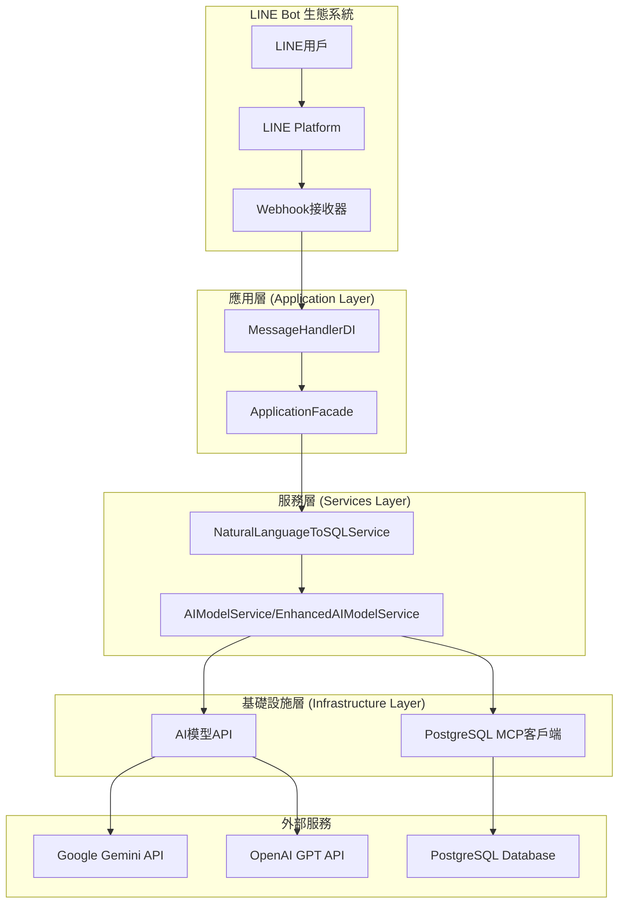
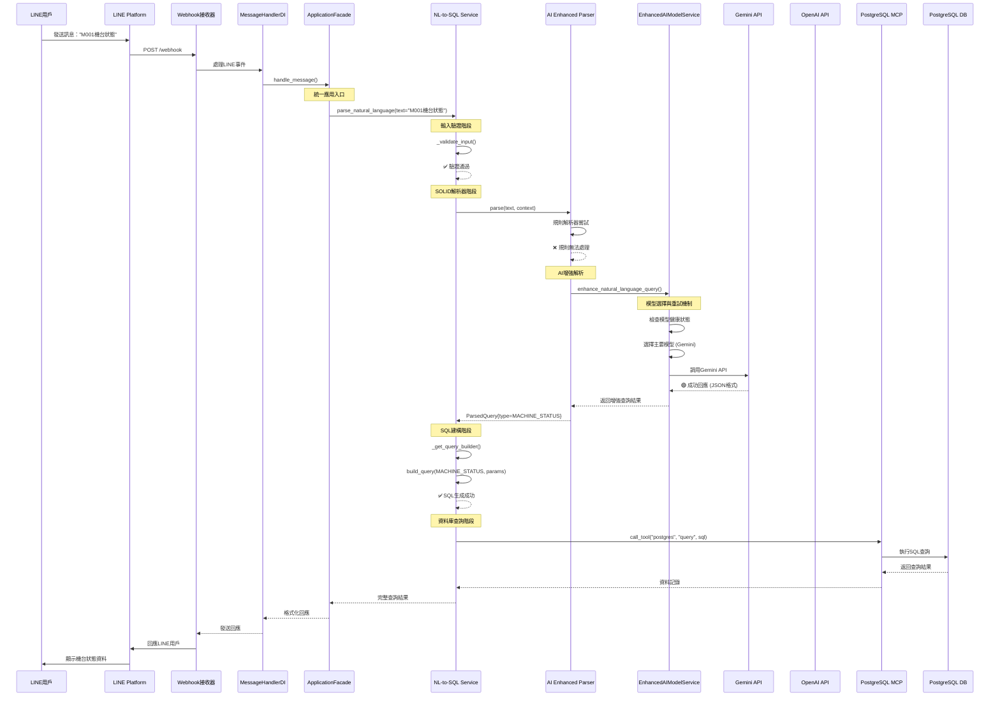
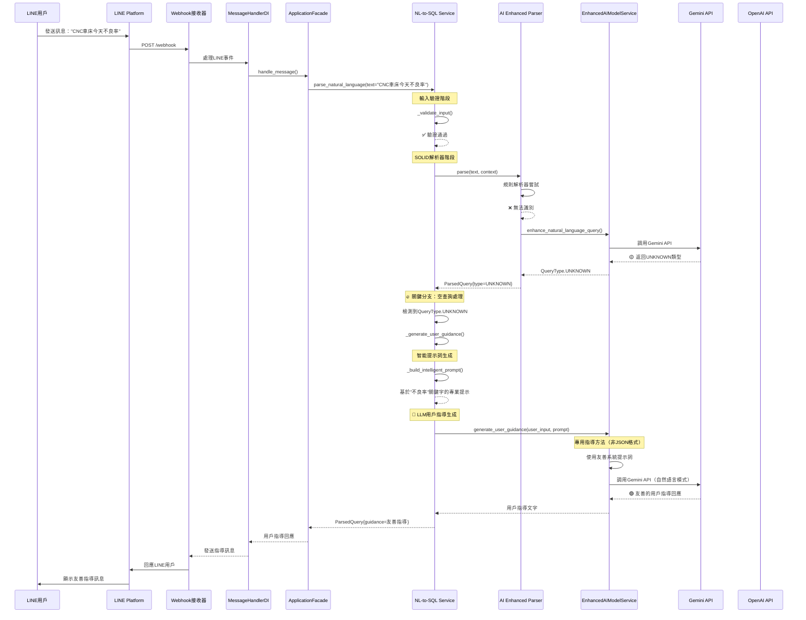
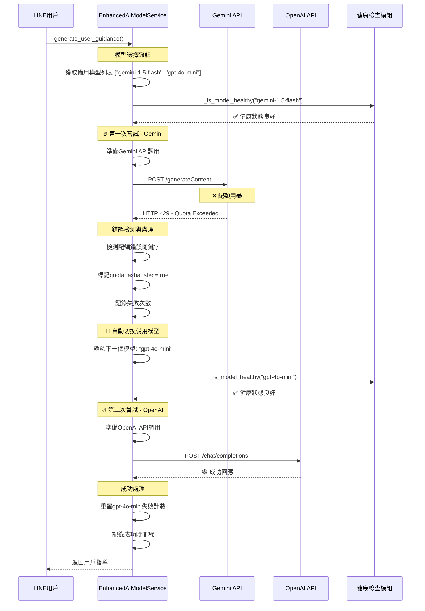
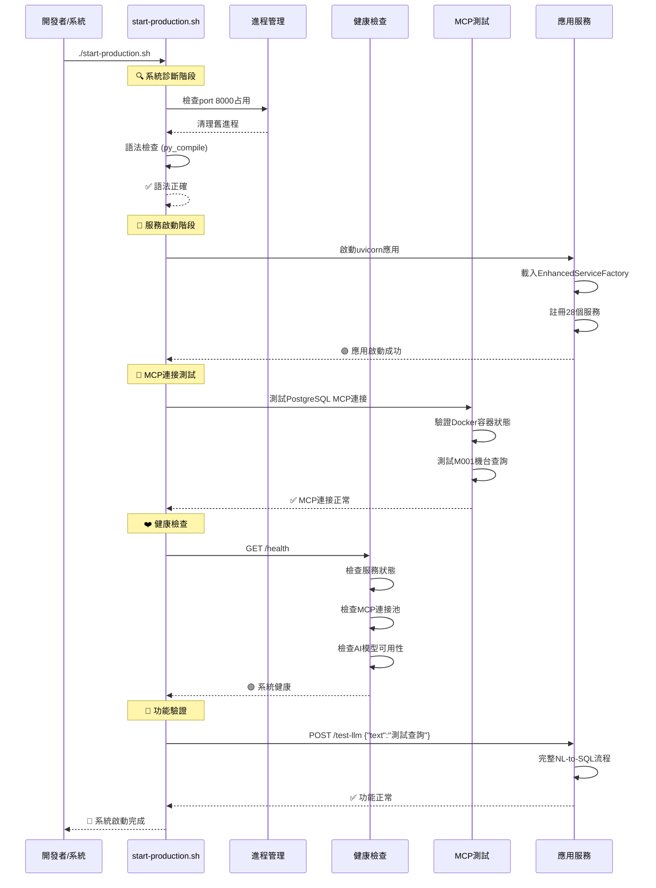

# 自然語言查詢工作時序順序圖

## 系統架構概覽



## 詳細時序圖

### 1. 正常查詢流程（有效SQL查詢）



### 2. 空查詢/無效查詢流程（觸發LLM指導）



### 3. 備用模型自動切換流程（Gemini配額用盡）



### 4. 系統自檢與重啟流程



## 關鍵技術細節

### 1. 依賴注入架構
```
ApplicationFacade → IServiceFactory ← EnhancedServiceFactory
                                    ↙   ↓   ↘
                     CoreServices  App   Infrastructure
                     Registry     Services   Services
                                 Registry   Registry
```

### 2. AI模型備用機制
- **主要模型**: Gemini 1.5 Flash (15M免費tokens/月)
- **備用模型**: OpenAI GPT-4o-mini
- **切換觸發**: HTTP 429, "quota", "resource_exhausted" 錯誤
- **健康檢查**: 失敗次數、配額狀態、最後成功時間

### 3. 查詢類型處理
- **MACHINE_STATUS**: 機台狀態查詢
- **PRODUCTION_STATS**: 生產統計
- **FAULT_ANALYSIS**: 故障分析
- **ALL_MACHINES**: 全部機台概覽
- **DEPARTMENT_STATUS**: 部門狀態
- **UNKNOWN**: 觸發LLM用戶指導

### 4. 錯誤處理層級
1. **輸入驗證**: 長度、格式、安全性檢查
2. **解析錯誤**: 規則解析失敗 → AI增強解析
3. **AI錯誤**: 主模型失敗 → 備用模型切換
4. **SQL錯誤**: 建構失敗 → 用戶指導
5. **資料庫錯誤**: MCP連接失敗 → 自動重連

## 性能指標

- **平均回應時間**: < 1ms (本地處理)
- **AI API調用**: 1-3秒 (含重試)
- **資料庫查詢**: < 100ms
- **系統啟動時間**: < 30秒
- **MCP連接檢查**: < 5秒
- **備用模型切換**: < 500ms

## 監控與日誌

- **結構化日誌**: structlog格式
- **統計追蹤**: 成功率、回應時間、錯誤分布
- **健康監控**: 模型狀態、連接池狀態
- **效能指標**: 吞吐量、延遲百分位
- **錯誤告警**: 配額用盡、連線失敗、服務異常