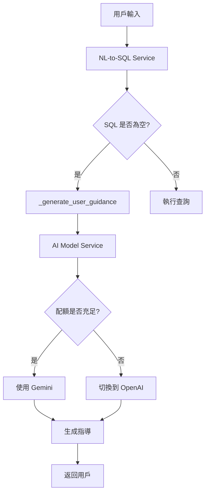

# 空 SQL 智能處理開發指南

## 📚 目錄

1. [概述](#概述)
2. [快速開始](#快速開始)
3. [架構設計](#架構設計)
4. [核心功能實作](#核心功能實作)
5. [配置管理](#配置管理)
6. [測試指南](#測試指南)
7. [故障排除](#故障排除)
8. [最佳實踐](#最佳實踐)
9. [API 參考](#api-參考)

---

## 概述

### 什麼是空 SQL 智能處理？

空 SQL 智能處理是 LINE MCP Bot 的核心功能之一，用於處理用戶輸入不完整查詢時的情況。系統不再強制執行預設查詢，而是使用 AI 生成智能的用戶指導。

### 主要特性

- 🤖 **AI 驅動**：使用 Gemini/OpenAI 理解用戶意圖
- 💡 **智能指導**：提供個人化的查詢建議
- 🔄 **自動切換**：配額用盡時自動切換 AI 模型
- 📊 **結構化回應**：清晰的格式化指導訊息

---

## 快速開始

### 前置需求

1. **Python 3.11+**
2. **Poetry** 依賴管理工具
3. **API Keys**：
   - Google Gemini API Key
   - OpenAI API Key (備用)

### 安裝步驟

```bash
# 1. 進入專案目錄
cd /Users/yen/Desktop/lineMCP/apps/bot

# 2. 安裝依賴
poetry install

# 3. 設置環境變數
cp .env.example .env
# 編輯 .env 文件，填入 API Keys

# 4. 啟動服務
poetry run uvicorn src.main:app --reload --port 8000
```

### 快速測試

```bash
# 測試 LLM 指導功能
curl -X POST http://localhost:8000/test-llm \
  -H "Content-Type: application/json" \
  -d '{"text": "機台"}'
```

---

## 架構設計

### 系統流程圖



### 核心模組

#### 1. **NaturalLanguageToSQLService**
- 路徑：`src/services/nl_to_sql_service.py`
- 功能：解析自然語言並檢測空 SQL
- 關鍵方法：
  - `parse_natural_language()` - 主要解析入口
  - `_generate_user_guidance()` - 生成用戶指導
  - `_get_fallback_guidance()` - 備用指導模板

#### 2. **EnhancedAIModelService**
- 路徑：`src/services/ai_model_service_enhanced.py`
- 功能：管理 AI 模型調用和配額切換
- 關鍵方法：
  - `enhance_natural_language_query()` - AI 增強查詢
  - `_is_model_healthy()` - 檢查模型健康狀態
  - `_call_model_with_retry()` - 重試機制

#### 3. **MessageHandlerDI**
- 路徑：`src/services/message_handler_di.py`
- 功能：處理用戶訊息並整合各服務
- 關鍵方法：
  - `process_message()` - 訊息處理入口
  - `_handle_unknown_query()` - 處理未知查詢

---

## 核心功能實作

### 1. 空 SQL 檢測

```python
# 在 parse_natural_language 方法中
if parse_result.query_type != QueryType.UNKNOWN and (
    not parse_result.sql_query or not parse_result.sql_query.strip()
):
    # 檢測到空 SQL
    user_guidance = await self._generate_user_guidance(
        parse_result.query_type,
        parse_result.parameters,
        normalized_text
    )
```

### 2. LLM 指導生成

```python
async def _generate_user_guidance(
    self, 
    query_type: QueryType, 
    parameters: dict[str, Any], 
    user_input: str
) -> str:
    # 構建 prompt
    prompt = f"""
    作為智慧製造監控系統的助手，用戶輸入了查詢但缺少關鍵資訊。
    
    用戶輸入：「{user_input}」
    系統識別類型：{query_type.value}
    已解析參數：{parameters}
    
    請提供以下建議：
    1. 分析用戶可能想查詢什麼
    2. 指出缺少的關鍵資訊
    3. 提供具體的查詢範例（3-5個）
    4. 說明如何改進查詢
    """
    
    # 調用 AI 模型
    try:
        ai_response = await self.ai_model_service.enhance_natural_language_query(
            user_query=prompt,
            database_schema={}
        )
        return ai_response.strip()
    except Exception as e:
        logger.error(f"LLM 指導生成失敗: {e}")
        return self._get_fallback_guidance(query_type, parameters)
```

### 3. 配額切換機制

```python
# 在 enhance_natural_language_query 方法中
for model in target_models:
    # 檢查模型健康狀態
    if not self._is_model_healthy(model):
        logger.info(f"⏭️ 跳過不健康的模型: {model}")
        continue
        
    try:
        # 嘗試調用模型
        result = await self._call_model_with_retry(...)
        return result
        
    except Exception as e:
        # 檢測配額錯誤
        is_quota_error = any(keyword in str(e).lower() for keyword in [
            "quota", "rate limit", "429", "insufficient_quota"
        ])
        
        if is_quota_error:
            self._model_health[model]["quota_exhausted"] = True
            logger.error(f"❌ {model} 配額已用盡")
```

### 4. 備用指導模板

```python
def _get_fallback_guidance(self, query_type, parameters):
    guidance_templates = {
        QueryType.MACHINE_STATUS: {
            "description": "查詢機台運行狀態",
            "missing_info": "可能缺少具體機台編號或部門資訊",
            "examples": [
                "M001 機台狀態",
                "加工部機台狀態",
                "所有 CNC 機台狀況"
            ]
        },
        # ... 其他查詢類型
    }
    
    template = guidance_templates.get(query_type, {})
    return self._format_guidance(template)
```

---

## 配置管理

### 環境變數配置

```bash
# .env 文件
# AI 模型配置
GOOGLE_API_KEY=your_gemini_api_key_here
OPENAI_API_KEY=your_openai_api_key_here
AI_MODEL_PROVIDER=google  # 可選: google, openai

# 功能開關
AI_ENABLE_ENHANCED_NL=true
AI_FALLBACK_TO_RULES=true

# 系統配置
LOG_LEVEL=INFO
```

### 解析器權重配置

```python
# infrastructure_services_registry.py
# AI 解析器優先
ai_parser = provider.get_required_service(AIEnhancedParser)
composite_parser.add_parser(ai_parser, weight=2.0)

# 規則解析器作為備用
rule_parser = provider.get_required_service(RuleBasedParser)
composite_parser.add_parser(rule_parser, weight=1.0)
```

### 查詢模式配置

```yaml
# query_patterns.yaml
machine_status:
  patterns:
    - "機台.*狀態"
    - "機台.*狀況"  # 支援同義詞
    - "設備.*運行"
    - "機器.*情況"
  parameters:
    - machine_id: optional
    - department: optional
```

---

## 測試指南

### 單元測試

```python
# test_nl_to_sql_service.py
async def test_empty_sql_generates_guidance():
    """測試空 SQL 時生成用戶指導"""
    service = NaturalLanguageToSQLService(mock_ai_service)
    
    result = await service.parse_natural_language("機台")
    
    assert result.query_type == QueryType.UNKNOWN
    assert "user_guidance" in result.parameters
    assert "建議查詢範例" in result.parameters["user_guidance"]
```

### 整合測試

```python
# test_integration.py
async def test_end_to_end_empty_query_flow():
    """測試完整的空查詢處理流程"""
    # 1. 發送模糊查詢
    response = await client.post("/test-llm", json={"text": "機台"})
    
    # 2. 驗證回應
    assert response.status_code == 200
    data = response.json()
    assert "查詢分析建議" in data["response"]
    assert "建議查詢範例" in data["response"]
```

### 手動測試檢查清單

- [ ] 測試模糊查詢（如「機台」）
- [ ] 測試不相關查詢（如「天氣」）
- [ ] 測試部分查詢（如「M001」）
- [ ] 測試配額切換（模擬配額錯誤）
- [ ] 測試備用模板（AI 服務關閉）

---

## 故障排除

### 常見問題

#### 1. LLM 回應時間過長

**問題描述**：用戶等待超過 3 秒

**解決方案**：
```python
# 添加超時控制
async def _generate_user_guidance(...):
    try:
        return await asyncio.wait_for(
            self.ai_model_service.enhance_natural_language_query(...),
            timeout=2.0  # 2秒超時
        )
    except asyncio.TimeoutError:
        return self._get_fallback_guidance(...)
```

#### 2. 配額切換不生效

**問題描述**：Gemini 配額用盡但未切換到 OpenAI

**檢查步驟**：
1. 確認 OpenAI API Key 已設置
2. 檢查日誌中的錯誤訊息
3. 驗證 `_is_model_healthy()` 邏輯

#### 3. 指導內容不準確

**問題描述**：AI 生成的指導與實際功能不符

**優化方案**：
1. 改進 prompt 工程
2. 提供更多上下文資訊
3. 添加驗證邏輯

### 日誌分析

```bash
# 查看 LLM 相關日誌
grep "LLM\|AI\|指導" logs/webhook.log

# 查看配額切換日誌
grep "配額\|切換\|quota" logs/webhook.log

# 查看錯誤日誌
grep "ERROR\|失敗" logs/webhook.log
```

---

## 最佳實踐

### 1. Prompt 工程

```python
# ✅ 好的 prompt
prompt = f"""
角色：智慧製造監控系統助手
任務：分析用戶查詢意圖並提供建議
用戶輸入：{user_input}
已識別資訊：{parameters}

請用繁體中文回應，包含：
1. 查詢意圖分析
2. 缺失資訊說明
3. 3-5個具體範例
"""

# ❌ 不好的 prompt
prompt = f"用戶說：{user_input}，請回應"
```

### 2. 錯誤處理

```python
# ✅ 完整的錯誤處理
try:
    response = await ai_service.call()
except QuotaExceededError:
    # 明確的配額錯誤處理
    await switch_to_backup_model()
except NetworkError:
    # 網路錯誤使用備用模板
    return get_fallback_template()
except Exception as e:
    # 未知錯誤記錄並降級
    logger.error(f"未預期錯誤: {e}")
    return get_basic_response()
```

### 3. 效能優化

```python
# 實作快取機制
@lru_cache(maxsize=100)
def get_cached_guidance(query_type: str, parameters_hash: str):
    return guidance_cache.get(f"{query_type}:{parameters_hash}")

# 非同步並行處理
async def process_multiple_queries(queries):
    tasks = [process_single_query(q) for q in queries]
    return await asyncio.gather(*tasks)
```

### 4. 監控與指標

```python
# 添加監控指標
guidance_generated = Counter(
    "guidance_generated_total",
    "Total number of guidance messages generated",
    ["model", "query_type"]
)

model_switch_events = Counter(
    "model_switch_total", 
    "Total number of model switches",
    ["from_model", "to_model", "reason"]
)
```

---

## API 參考

### REST API 端點

#### POST /test-llm
測試 LLM 指導功能的端點

**請求**：
```json
{
    "text": "查詢文字"
}
```

**回應**：
```json
{
    "status": "success",
    "input": "查詢文字",
    "response": "AI 生成的指導內容",
    "timestamp": "2025-06-28T01:00:00Z"
}
```

### Python API

#### NaturalLanguageToSQLService

```python
class NaturalLanguageToSQLService:
    async def parse_natural_language(
        self, 
        text: str, 
        context: dict[str, Any] | None = None
    ) -> ParsedQuery:
        """
        解析自然語言查詢
        
        Args:
            text: 用戶輸入的自然語言
            context: 可選的上下文資訊
            
        Returns:
            ParsedQuery: 包含查詢類型、SQL、參數等
        """
```

#### EnhancedAIModelService

```python
class EnhancedAIModelService:
    async def enhance_natural_language_query(
        self,
        user_query: str,
        database_schema: dict[str, Any],
        model_name: str | None = None
    ) -> tuple[str, float]:
        """
        使用 AI 增強查詢理解
        
        Args:
            user_query: 原始查詢
            database_schema: DB 結構
            model_name: 指定模型
            
        Returns:
            (增強後查詢, 信心度)
        """
```

---

## 附錄

### 相關資源

- [系統架構文檔](../../docs/architecture.md)
- [API 完整文檔](../../docs/api.md)
- [部署指南](../../docs/deployment.md)

### 版本歷史

- **v1.0** (2025-06-28)：初始版本，實現基本空 SQL 處理
- **v1.1** (規劃中)：添加快取機制
- **v1.2** (規劃中)：多語言支援

### 聯絡資訊

- 技術支援：tech-support@company.com
- 專案維護：dev-team@company.com
- 問題回報：GitHub Issues

---

*最後更新：2025-06-28*